<br/>
<br/>
<br/>

<div align=center></div>

<br/>

<center> <font size = 6>2020年春季学期 </font></center>
<center> <font size = 6>计算学部《机器学习》课程 </font></center>

<br/>
<br/>

<center> <font size = 6> Lab1 实验报告 </font></center>

<br/>
<br/>
<br/>
<br/>
<br/>
<br/>
<br/>
<br/>
<br/>
<br/>
<br/>
<br/>
<br/>

<center> <font size = 3> 
<table>
   <tr>
      <td>姓名</td>
      <td>许健</td>
   </tr>
   <tr>
      <td>学号</td>
      <td>1183710113</td>
   </tr>
   <tr>
      <td>班号</td>
      <td>1837101</td>
   </tr>
   <tr>
      <td>电子邮件</td>
      <td>941197279@qq.com</td>
   </tr>
   <tr>
      <td>手机号码</td>
      <td>18945062342</td>
   </tr>
</table>
</font></center>


<br/>
<br/>


<div STYLE="page-break-after: always;"></div>

<!-- 此处用于换行 -->

# 1 实验目的

掌握最小二乘法求解（无惩罚项的损失函数）、掌握加惩罚项（2范数）的损失函数优化、梯度下降法、共轭梯度法、理解过拟合、克服过拟合的方法(如加惩罚项、增加样本)


# 2 实验要求及实验环境

## 2.1 实验要求

1. 生成数据，加入噪声；

2. 用高阶多项式函数拟合曲线；

3. 用解析解求解两种loss的最优解（无正则项和有正则项）

4. 优化方法求解最优解（梯度下降，共轭梯度）；

5. 用你得到的实验数据，解释过拟合。

6. 用不同数据量，不同超参数，不同的多项式阶数，比较实验效果。

7. 语言不限，可以用matlab，python。求解解析解时可以利用现成的矩阵求逆。梯度下降，共轭梯度要求自己求梯度，迭代优化自己写。不许用现成的平台，例如pytorch，tensorflow的自动微分工具。

## 2.2 实验环境

Windows10; python3.8.5; jupyter notebook


# 3 设计思想

由泰勒级数可知，足够高阶的多项式可以拟合任意的函数，所以本次实验使用多项式来拟合正弦函数 $sin(2\pi x)$。在 $m$ 阶多项式中，有 $m+1$ 个待定系数，这些系数（由低到高）组成的列向量记作 $w$。用最小二乘法确定 $w$，设 $E(w) = 1/2 * (Xw – Y)^T(Xw– Y)$，其中，$X$ 为多项式中各个未知项代入观测数据求得的矩阵，若记 $X_i$ 为 $X$ 的第 $i$ 行的向量，则 $X_i[j]$ 为第$ i $个观测数据 $x_i$ 的 $j$ 次方，记有 $n$ 组观测数据，多项式最高次为 $m$，易知$X $的维度为 $ n*(m+1)$。$Y$ 为观测标签向量，$Y[j]$ 为第  $j$  组观测数据的标签值(即 $y$ 值)。从而问题转化为：求向量 $w$，使得 $E(w)$ 最小。

## 3.1 生成数据

根据输入的多项式阶数和训练集大小参数生成相应大小的数据集，根据输入的高斯分布的均值和标准差参数生成噪声，将噪声加入到数据集中，最后根据数据集生成训练集等数据。

```python
def generate_data(order, size, mu=0, sigma=0.05, begin=0, end=1):
    x = np.arange(begin, end, (end - begin) / size)
    guass_noise = np.random.normal(mu, sigma, size) # 高斯分布噪声
    y = np.sin(2 * np.pi * x) + guass_noise
    train_y = y.reshape(size, 1)
    train_x = np.zeros((size, order + 1))
    nature_row = np.arange(0, order+1)
    for i in range(size):
        row = np.ones(order + 1) * x[i]
        row = row ** nature_row
        train_x[i] = row
    return train_x, train_y, x, y
```

## 3.2 最小二乘法求解析解(无正则项)

$$
\begin{aligned}
E(\pmb{w})&=\frac 1 2(\pmb {Xw}-\pmb Y)^T(\pmb{Xw}-\pmb Y)\\
&=\frac 1 2(\pmb w^T\pmb X^T-\pmb Y)(\pmb {Xw}-\pmb Y)\\
&=\frac 1 2(\pmb w^T\pmb X^T\pmb X\pmb w-\pmb w^T\pmb X^T\pmb Y-\pmb Y^T\pmb X\pmb w+\pmb X^T\pmb Y)\\
&=\frac 1 2(\pmb w^T\pmb X^T\pmb{Xw}-2\pmb w^T\pmb X^T\pmb Y+\pmb X^T\pmb Y)\\
\end{aligned}
$$

令
$$
\frac{\partial E}{\partial \pmb w} = \pmb X^T\pmb{Xw}-\pmb X^T\pmb Y =0
$$
得
$$
\pmb w=(\pmb X^T\pmb X)^{-1}\pmb X^T\pmb Y
$$

```python
w = np.linalg.inv(np.dot(train_x.T, train_x)).dot(train_x.T).dot(train_y)
```

## 3.3 最小二乘法求解析解(有正则项)

$$
\begin{aligned}
\widetilde{E}(\pmb{w})&=\frac 1 2(\pmb {Xw}-\pmb Y)^T(\pmb{Xw}-\pmb Y) + \frac\lambda 2 ||\pmb w||_2\\
&=\frac 1 2(\pmb w^T\pmb X^T-\pmb Y)(\pmb {Xw}-\pmb Y) + \frac \lambda 2\pmb w^T\pmb w\\
&=\frac 1 2(\pmb w^T\pmb X^TX\pmb w-\pmb w^T\pmb X^T\pmb Y-\pmb Y^T\pmb X\pmb w+\pmb X^T\pmb Y) + \frac \lambda 2\pmb w^T\pmb w\\
&=\frac 1 2(\pmb w^T\pmb X^T\pmb{Xw}-2\pmb w^T\pmb X^T\pmb Y+\pmb X^T\pmb Y) + \frac \lambda 2\pmb w^T\pmb w\\
\end{aligned}
$$

令
$$
\frac{\partial \widetilde {E}}{\partial \pmb w} = \pmb X^T\pmb{Xw}-\pmb X^T\pmb Y + \lambda \pmb w=0
$$


得
$$
\pmb w=(\pmb X^T\pmb X + \lambda)^{-1}\pmb X^T\pmb Y
$$

```python
w = np.linalg.inv(np.dot(train_x.T, train_x) +
                  lamda * np.eye(train_x.shape[1])).dot(train_x.T).dot(train_y)
```

## 3.4 梯度下降法求优化解

$$
\begin{aligned}
\widetilde{E}(\pmb{w})&=\frac 1 2(\pmb {Xw}-\pmb Y)^T(\pmb{Xw}-\pmb Y) + \frac\lambda 2 ||\pmb w||_2\\
&=\frac 1 2(\pmb w^T\pmb X^T\pmb{Xw}-2\pmb w^T\pmb X^T\pmb Y+\pmb X^T\pmb Y) + \frac \lambda 2\pmb w^T\pmb w\\
\end{aligned}
$$

对 $\pmb w$ 求导
$$
\frac{\partial \widetilde {E}}{\partial \pmb w} = \pmb X^T\pmb{Xw}-\pmb X^T\pmb Y + \lambda \pmb w
$$
设步长（学习率）为$\alpha$，对 $\pmb w$ 梯度下降，直到迭代结束或收敛
$$
\pmb w =\pmb w - \alpha\cdot \frac {\partial \widetilde E} {\partial \pmb w}
$$
当新的损失值大于原来的损失值的时候，说明步长过大，此时将步长折半

```python
w = np.zeros((train_x.shape[1], 1))
new_loss = abs(loss(train_x, train_y, w, lamda))
for i in range(times):
    old_loss = new_loss
    gradient_w = np.dot(train_x.T, train_x).dot(w) - np.dot(train_x.T, train_y) + lamda * w
    old_w = w
    w -= gradient_w * alpha
    new_loss = abs(loss(train_x, train_y, w, lamda))
    if old_loss < new_loss: #不下降了，说明步长过大
        w = old_w
        alpha /= 2
    if old_loss - new_loss < epsilon:
        break
```

## 3.5 共轭梯度法求优化解

先令
$$
\frac{\partial \widetilde {E}}{\partial \pmb w} = \pmb X^T\pmb{Xw}-\pmb X^T\pmb Y + \lambda \pmb w=0
$$
则求 $(\pmb X^T\pmb X + \lambda)\pmb w = \pmb X^T\pmb Y$ 的解析解，记 $A = \pmb X^T\pmb X + \lambda$，$\pmb b = \pmb X^T\pmb Y$，则求使残差满足精度的$\pmb w$

```python
A = np.dot(train_x.T, train_x) + lamda * np.eye(train_x.shape[1]) # n+1 * n+1
b = np.dot(train_x.T, train_y) # n+1 * 1
```

初始化 $\pmb w_0 = 0$，$\pmb r_0 = \pmb b$，$\pmb p_0 = \pmb r_0$

```python
w = np.zeros((train_x.shape[1], 1)) #  初始化w为 n+1 * 1 的零阵
r = b
p = b
```

当$\pmb r_k$ 不满足精度时，进入循环，对第 $k$ 次循环，计算：

$$
a_k = \frac {\pmb r_k^T \pmb r_k}{\pmb p_k^T\pmb A\pmb p_k}\\
\pmb w_k = \pmb w_k + a_k\pmb p_k\\
\pmb r_{k+1} = \pmb r_k - a_k\pmb A\pmb p_k\\
b_k =\frac {\pmb r_{k+1}^T \pmb r_{k+1}}{\pmb r_k^T \pmb r_k}\\
\pmb p_{k+1} = \pmb r_{k+1} + b_k \pmb p_k
$$

```python
while True:
    if r.T.dot(r) < epsilon:
        break
    norm_2 = np.dot(r.T, r)
    a = norm_2 / np.dot(p.T, A).dot(p)
    w = w + a * p
    r = r - (a * A).dot(p)
    b = np.dot(r.T, r) / norm_2
    p = r + b * p
```


# 4 实验结果分析

## 4.1 不带正则项的解析解

固定训练集大小为10，在不同多项式阶数下的拟合结果

- 1阶：$y = -1.477 x + 0.7385$

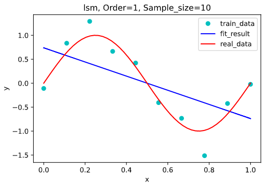

- 3阶：$y = 19.22 x^3 - 29.8 x^2 + 10.51 x - 0.1571$

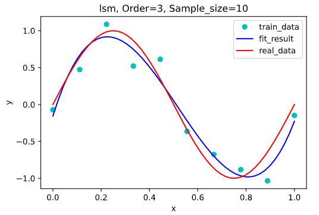

- 5阶：$y =-68.05 x^5 + 163 x^4 - 112 x^3 + 11.12 x^2 + 6.302 x - 0.07645$

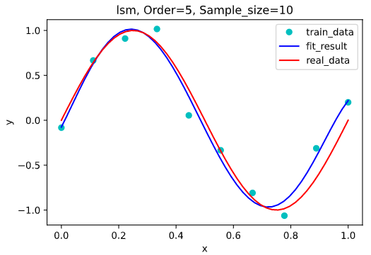

- 9阶：$y=7480 x^9 - 24580 x^8 + 27680x^7 - 7577 x^6 - 9072 x^5 + 8667 x^4 - 3041 x^3  + 459.6 x^2 - 18.49 x + 0.08736$

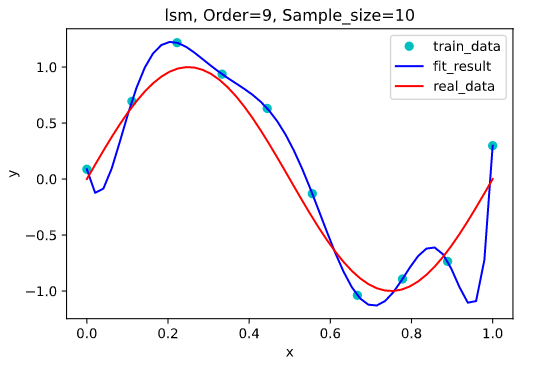

在1阶的时候，基本无法拟合，属于欠拟合，提高阶数，3阶的情况下拟合效果已经足够好，继续提高阶数，直到9阶时拟合函数图像完美的穿过了所有的训练集上的点，但是由于过于关注于“穿过训练集上所有的点”这一条件，导致函数的波动较大，反而难以拟合数据集所代表的函数$sin(2\pi x)$

但是增加训练数据集可以有效地降低阶数过高带来的过拟合现象的影响，下图为不同训练集大小的9阶多项式拟合图像。

- 训练集大小为20：$y = -6173 x^9 + 24930 x^8 - 40640 x^7 + .4000 x^6 - 15200 x^5 + 3359 x^4 - 238.9 x^3 - 38.22 x^2 + 10.54 x + 0.1475$

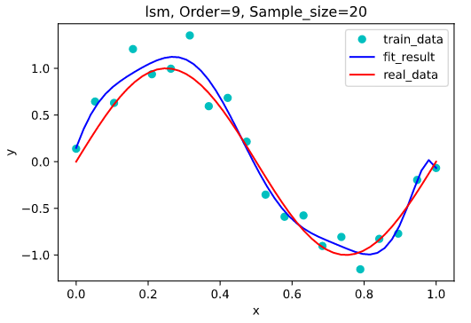

- 训练集大小为50：$y= 3482 x^9 - 14150 x^8 + 23430 x^7 - 20300 x^6 + 9831 x^5 - 2591 x^4 + 325.9 x^3 - 28.06 x^2 + 7.356 x + 0.08484$

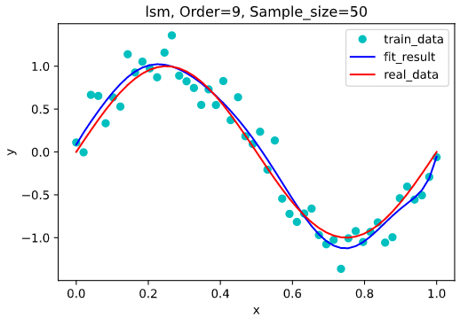

- 训练集大小为100：$y=-3279 x^9 + 14850 x^8 - 27980 x^7 + 28350 x^6 - 16720 x^5 + 5838 x^4 - 1173 x^3 + 106.8 x^2 + 2.833 x + 0.002364$

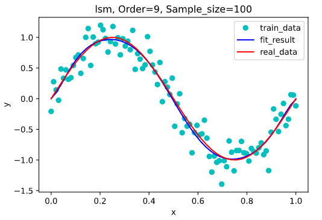

从上面几张图可以看出，在训练集大小为10时，过拟合现象最为严重，随着训练集的增大，过拟合现象逐渐被消除，当训练集大小为100时，我们生成的拟合函数已经几乎完美拟合到了的原数据点的函数上。

## 4.2 带正则项的解析解

根据3.3中公式所描述的，我们需要确定一个最优的$\lambda$，使用均方根来判断不同参数取值的拟合效果。

训练集大小为10，验证集大小为20，拟合多项式阶为9，多次运行的拟合效果如下：

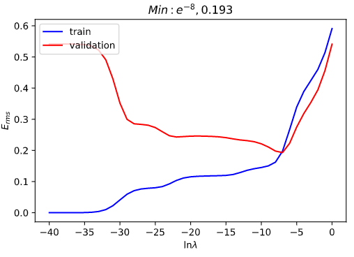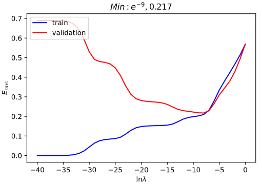

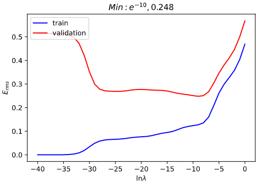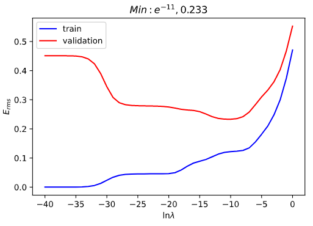

通过多次运行的结果可以看出，随着 $\lambda$ 取值的减小，拟合函数在训练集上的错误率逐渐减小，在$(e^{-40}, e^{-30})$ 区间内的错误率几乎为0，而在验证集上，在 $\lambda > e^{-7}$ 时，随着取值的减小，拟合函数的错误率逐渐减小，但是在 $\lambda < e^{-15}$ 之后的验证集上的错误率开始上升，说明出现了过拟合现象。

根据多次运行的结果可得最佳的 $\lambda$ 取值范围大约为 $(e^{-11}, e^{-7})$ 。

取 $\lambda = e^{-9}$ ，在训练集大小为10，阶数为9的条件下的带惩罚项和不带惩罚项的拟合图像比较。

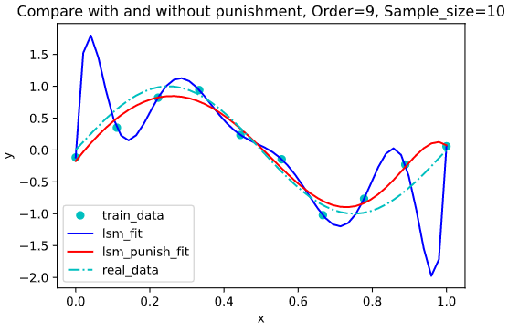

可以看到，加入正则项后有效的降低了过拟合现象。

## 4.3 梯度下降求得优化解

在梯度下降法中，学习率为0.01，根据4.2中的结果取$\lambda = e^{-9}$

**固定训练集大小为10，在不同多项式阶数下的拟合结果** (左图精度为$10^{-5}$，右图精度为$10^{-6})$：

- 3阶，迭代次数：左=37005，右=116453

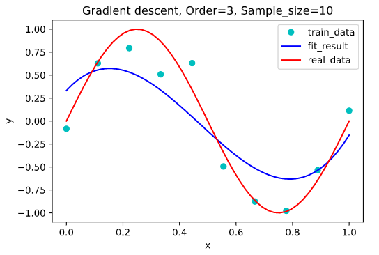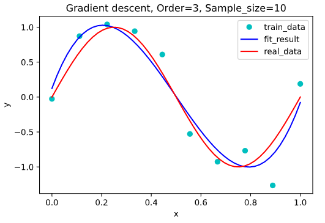

- 5阶，迭代次数：左=17294，右=29646

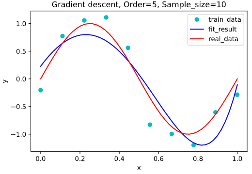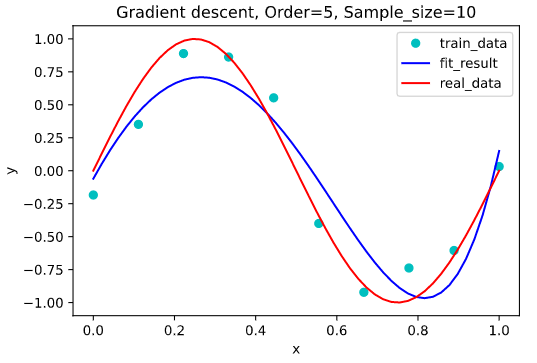

- 7阶，迭代次数：左=9435，右=78793

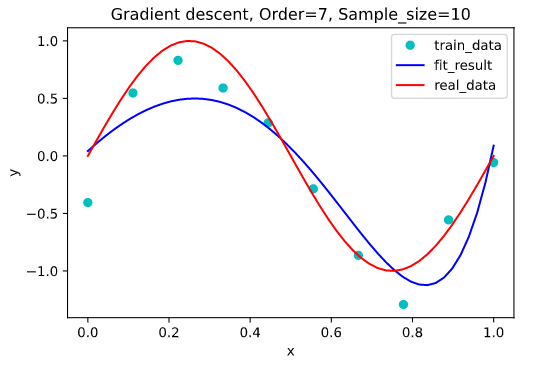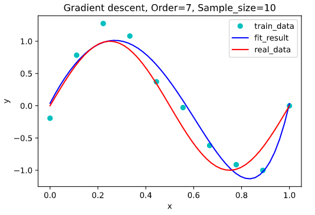

- 9阶，迭代次数：左=23286，右=69858 

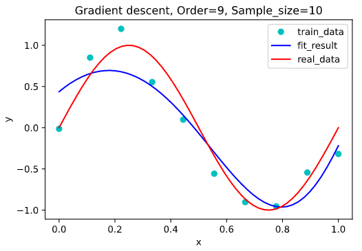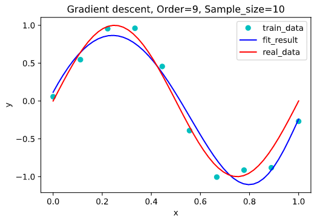

**固定阶数为9，不同训练集大小下的拟合结果** (左图精度为$10^{-5}$，右图精度为$10^{-6})$：

- 训练集大小为20，迭代次数：左=27609，右=49967

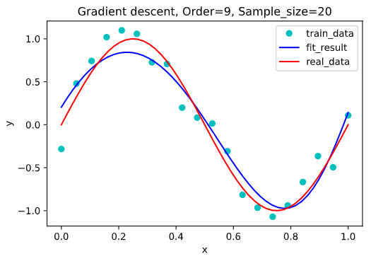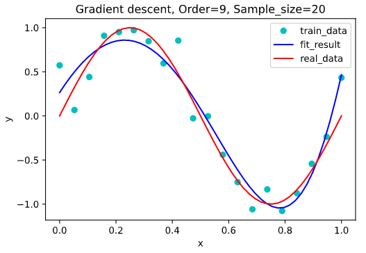

- 训练集大小为50，迭代次数：左=20001，右=39570

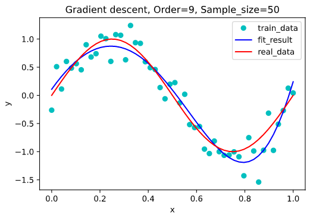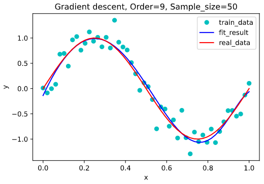

- 训练集大小为100，迭代次数：左=17010，右=29397

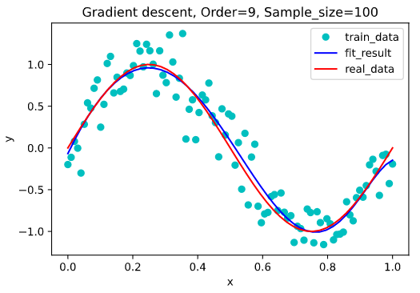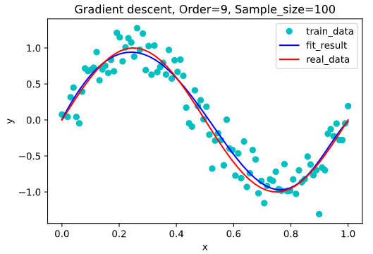

从上面的图可以看出，同条件下精度为$10^{-6}$的右图的拟合效果要显著强于精度为$10^{-5}$下的拟合效果。

随精度的升高，迭代次数变大；随多项式阶增大，迭代次数呈现下降趋势；训练集的大小对于迭代次数几乎没有影响，但仍然满足训练集越大拟合效果也好的结论。

从上面的迭代次数还可以得出一个结论：无论精度是$10^{-5}$还是$10^{-6}$，它们的迭代次数的量级都在$10^5$，与共轭梯度相比，性能很差。

## 4.4 共轭梯度求得优化解

在共轭梯度法中，根据4.2中的结果取$\lambda = e^{-9}$

**固定训练集大小为10，在不同多项式阶数下的拟合结果** (左图精度为$10^{-5}$，右图精度为$10^{-6})$：

- 3阶，迭代次数：左=4，右=4

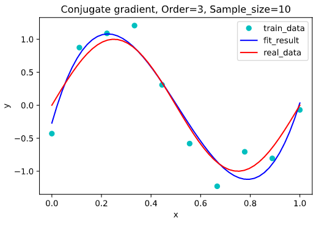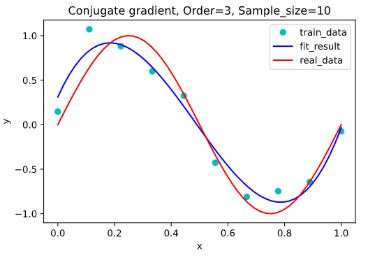

- 5阶，迭代次数：左=5，右=5

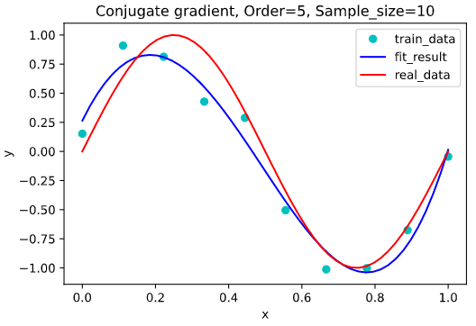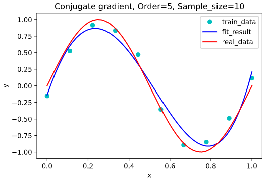

- 7阶，迭代次数：左=7，右=5

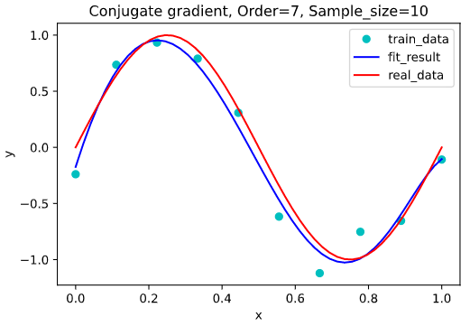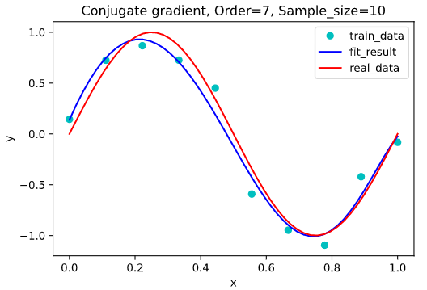

- 9阶，迭代次数：左=5，右=5

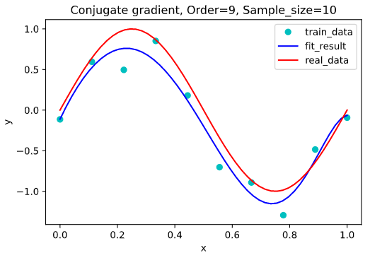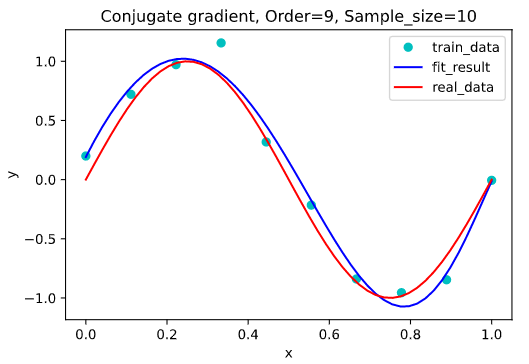

**固定阶数为9，不同训练集大小下的拟合结果** (左图精度为$10^{-5}$，右图精度为$10^{-6})$：

- 训练集大小为20，迭代次数：左=5，右=7

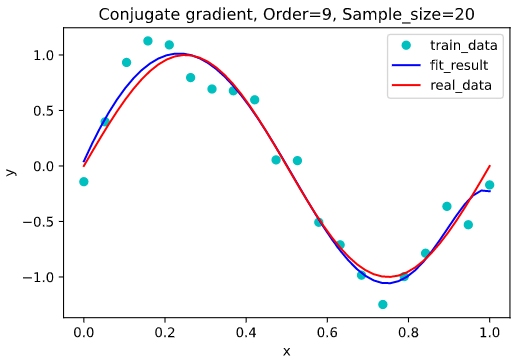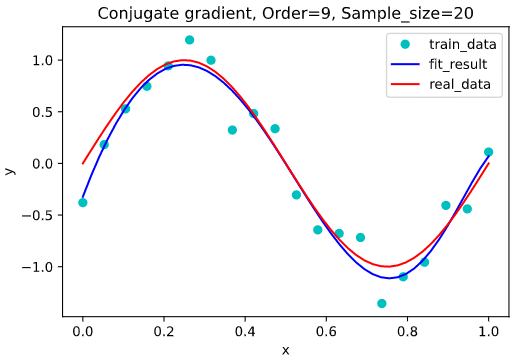

- 训练集大小为50，迭代次数：左=5，右=7

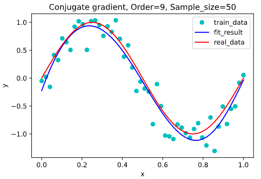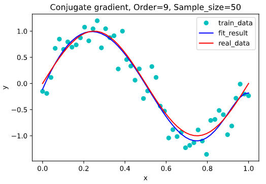

- 训练集大小为100，迭代次数：左=7，右=5

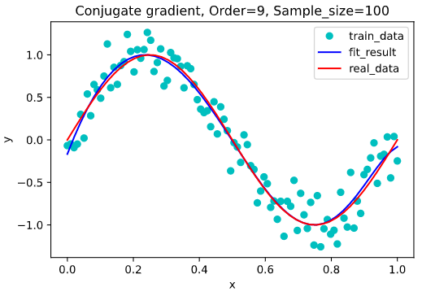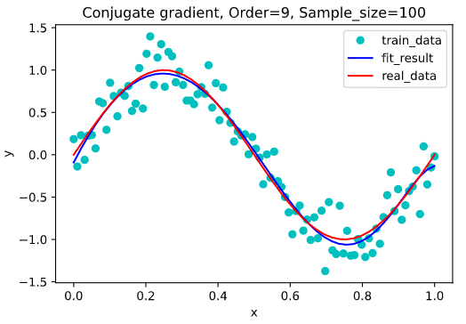

从上面的图可以看出，同条件下精度为$10^{-6}$的右图的拟合效果并未显著强于精度为$10^{-5}$下的拟合效果，这与梯度下降的结果大相径庭。

共轭梯度法的迭代次数受精度、多项式阶、训练集的大小的影响并不大，一直稳定在 $(10^0, 10^1)$ 级别范围内。

共轭梯度法同样满足训练集越大拟合效果也好的结论。

## 4.5 四种方法拟合效果对比

精度取$10^{-6}$，训练集大小为10，不同多项式阶数的拟合效果：

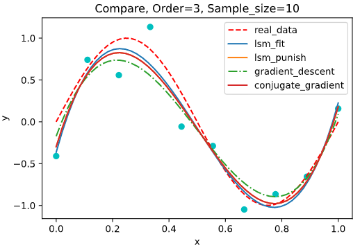

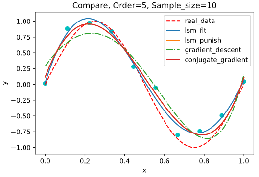

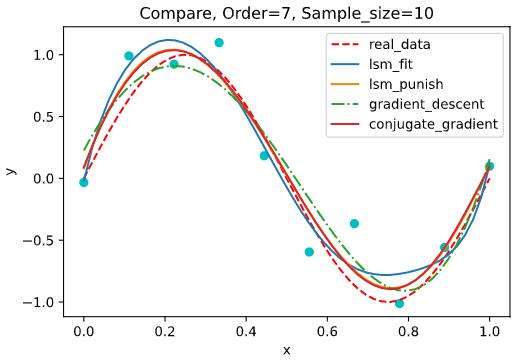

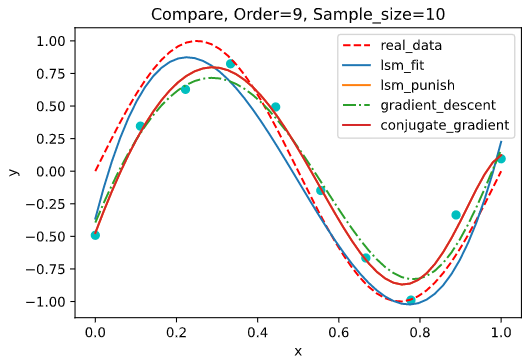


# 5 结论

在对正弦函数的多项式拟合中，多项式的次数越高，其模型能力越强，在不加正则项的情况下，高次多项式的拟合效果出现了过拟合，这是由于样本数量少但模型能力强导致的，模型拟合结果过分依赖数据集，而样本不足使得数据存在一定偶然性，这种强拟合能力可能无法拟合出正弦曲线的效果。所以增大数据集可以有效地解决过拟合问题。

在目标函数中加入参数的惩罚项后，过拟合现象得到明显改善。这是由于参数增多时，往往具有较大的绝对值，加入正则项可以有效地降低参数的绝对值，从而使模型复杂度与问题匹配。所以对于训练样本限制较多的问题，增加惩罚项是解决过拟合问题的有效手段。

在使用梯度下降时，由于我们的目标函数是二次的，只有一个极值点，即最值点，所以梯度下降的初值选取并不很重要。如果梯度下降步长设置的比较大，那么下降结果将在目标函数最值附近逐渐向上跳动，从而无法收敛。

梯度下降相比共轭梯度收敛速度很慢，迭代次数很大，而共轭梯度的稳定性较差，更容易出现过拟合现象，但对于数据量较大复杂度较高的情况，共轭梯度显然要比梯度下降来的更优。