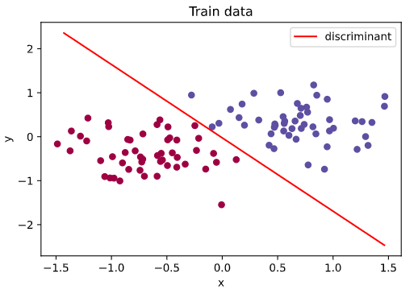
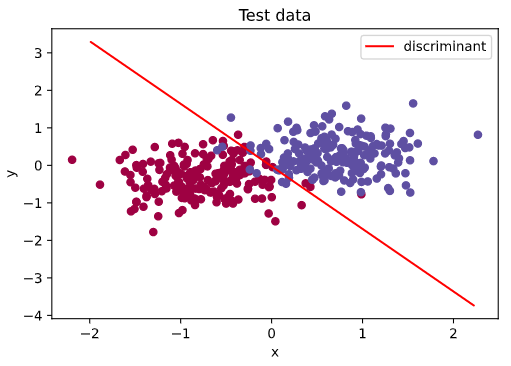
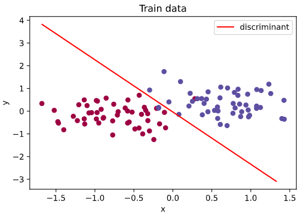
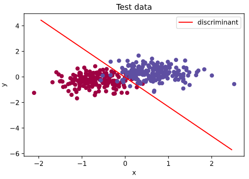
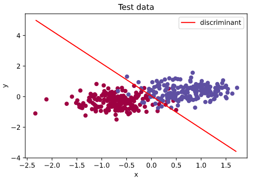
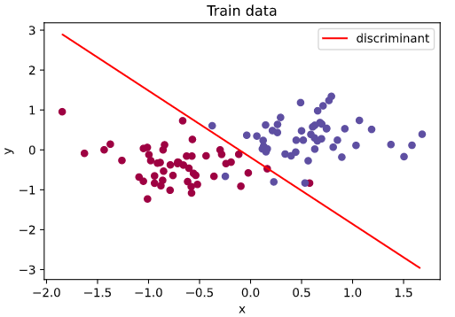
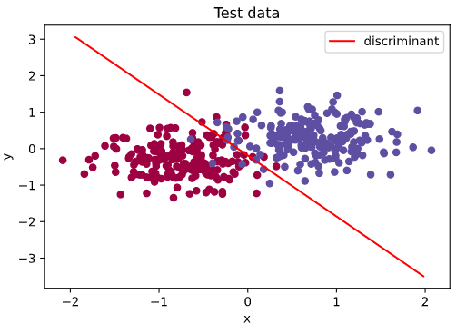
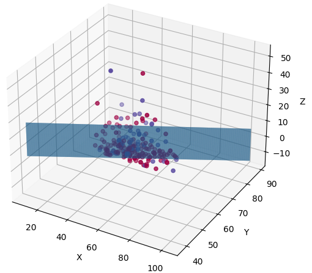

<br/>
<br/>

<div align=center></div>

<br/>

<center> <font size = 6>2020年春季学期 </font></center>
<center> <font size = 6>计算学部《机器学习》课程 </font></center>

<br/>
<br/>

<center> <font size = 6> Lab2 实验报告 </font></center>

<br/>
<br/>
<br/>
<br/>
<br/>
<br/>
<br/>
<br/><br/>
<br/><br/><br/>
<br/>

<center> <font size = 3> 
<table>
   <tr>
      <td>姓名</td>
      <td>许健</td>
   </tr>
   <tr>
      <td>学号</td>
      <td>1183710113</td>
   </tr>
   <tr>
      <td>班号</td>
      <td>1837101</td>
   </tr>
   <tr>
      <td>电子邮件</td>
      <td>941197279@qq.com</td>
   </tr>
   <tr>
      <td>手机号码</td>
      <td>18945062342</td>
   </tr>
</table>
</font></center>

<br/>
<br/>


<div STYLE="page-break-after: always;"></div>

<!-- 此处用于换行 -->


# 1 实验目的

理解逻辑回归模型，掌握逻辑回归模型的参数估计算法。


# 2 实验要求及实验环境

## 2.1 实验要求

实现两种损失函数的参数估计（1.无惩罚项；2.加入对参数的惩罚），可以采用梯度下降、共轭梯度或者牛顿法等。

验证：

1. 可以手工生成两个分别类别数据（可以用高斯分布），验证你的算法。考察类条件分布不满足朴素贝叶斯假设，会得到什么样的结果。

2. 逻辑回归有广泛的用处，例如广告预测。可以到UCI网站上，找一实际数据加以测试。

## 2.2 实验环境

Windows 10, Python 3.8.5, Jupyter notebook


# 3 实验原理

分类器做分类问题的实质是预测一个已知样本的位置标签，即$P(Y=1|X=< X_1,...,X_n>)$。按照朴素贝叶斯的方法，可以用贝叶斯概率公式将其转化为类条件概率(似然)和类概率的乘积。本实验是直接求该概率。

假设分类问题是一个0/1二分类问题：
$$
\begin{aligned}
P(Y=1|X)&=\frac {P(Y=1)P(X|Y=1)} {P(X)}\\
&=\frac{P(Y=1)P(X|Y=1)} {P(Y=1)P(X|Y=1)+P(Y=0)P(X|Y=0)}\\
&=\frac {1}{1+\frac{P(Y=0)P(X|Y=0)}{P(Y=1)P(X|Y=1)}}\\
&=\frac {1}{1+\exp (\ln\frac{P(Y=0)P(X|Y=0)}{P(Y=1)P(X|Y=1)})}
\end{aligned}
$$
令$\pi = P(Y=1)$，$1-\pi = P(Y=0)$
$$
P(Y=1|X)=\frac{1}{1+\exp(\ln \frac{1-\pi}{\pi}+\sum_i \ln \frac {P(X_i|Y=0)}{P(X_i|Y=1)})}\\
$$

假设类条件分布服从正态分布且方差不依赖于$k$。$P(x|y_k)=\frac {1}{\sigma_i\sqrt{2\pi}}e^{\frac{-(x-\mu_k)^2}{2\sigma_i^2}}\\$
$$
\begin{aligned}
P(Y=1|X)&=\frac{1}{1+\exp(\ln \frac{1-\pi}{\pi}+\sum_i \ln \frac {\frac {1}{\sigma_i\sqrt{2\pi}}e^{\frac{-(x_i-\mu_{i0})^2}{2\sigma_i^2}}}{\frac {1}{\sigma_i\sqrt{2\pi}}e^{\frac{-(x_i-\mu_{i1})^2}{2\sigma_i^2}}\\})}\\
&=\frac{1}{1+\exp(\ln \frac{1-\pi}{\pi}+\sum_i \ln \frac {e^{\frac{-(x_i-\mu_{i0})^2}{2\sigma_i^2}}}{e^{\frac{-(x_i-\mu_{i1})^2}{2\sigma_i^2}}\\})}\\
&=\frac{1}{1+\exp(\ln \frac{1-\pi}{\pi}+\sum_i (\frac{-(x_i-\mu_{i0})^2}{2\sigma_i^2}- \frac{-(x_i-\mu_{i1})^2}{2\sigma_i^2}))}\\
&=\frac{1}{1+\exp(\ln \frac{1-\pi}{\pi}+\sum_i (\frac{(x_i-\mu_{i1})^2}{2\sigma_i^2} - \frac{(x_i-\mu_{i0})^2}{2\sigma_i^2}))}\\
&=\frac{1}{1+\exp(\ln \frac{1-\pi}{\pi}+\sum_i (\frac{\mu_{i0}-\mu_{i1}}{\sigma_i^2}x_i + \frac{\mu_{i1}^2-\mu_{i0}^2}{2\sigma_i^2}))}\\
\end{aligned}
$$
令$w_0=\ln \frac{1-\pi}{\pi} + \sum_i\frac{\mu_{i1}^2-\mu_{i0}^2}{2\sigma_i^2}$，$w_i=\frac{\mu_{i0}-\mu_{i1}}{\sigma_i^2}$，则有：
$$
P(Y=1|X)=\frac{1}{1+\exp{(w_0+\sum_{i=1}^n w_iX_i)}}
$$

使用极大条件似然估计来计算损失函数 $l(w)$，此时有
$$
P(Y=0|X,W)=\frac{1}{1+\exp{(w_0+\sum_{i=1}^n w_iX_i)}}
$$
所以损失函数
$$
\begin{aligned}
l(W)&=\sum_lY^l\ln\,P(Y^l=1|X^l,W) + (1-Y^l)\ln\,P(Y^l=0|X^l,W)\\
&=\sum_l Y^l\ln\,\frac{P(Y^l=1|X^l,W)}{P(Y^l=0|X^l,W)} - \ln\,P(Y^l=0|X^l,W)\\
&=\sum_l Y^l(w_0+\sum_{i=1}^n w_iX_i) - \ln (1+exp(w_0+\sum_{i=1}^n w_iX_i) 
\end{aligned} \tag{1}
$$
我们要求$\arg \max_w\;l(w)$，也就是求$\arg \min_w -l(w)$，用梯度下降法求解
$$
\frac {\partial\,l(W)} {\partial\, w_i} = \sum_l\,X_i^l(Y^l-\frac{1}{1+\exp{(w_0+\sum_{i=1}^n w_iX_i^l)}}) \tag{2}\\
w_i = w_i - \eta\sum_l\,X_i^l(Y^l-\frac{1}{1+\exp{(w_0+\sum_{i=1}^n w_iX_i^l)}})
$$
向量形式
$$
\pmb W=\pmb W-\eta \sum_l \pmb X^l(\pmb Y^l-\frac{1}{1+\exp(\pmb {WX^l})})
$$
为了控制过拟合问题增加正则项
$$
w_i = w_i - \eta\lambda w_i - \eta\sum_l\,X_i^l(Y^l-\frac{1}{1+\exp{(w_0+\sum_{i=1}^n w_iX_i^l)}})
$$
向量形式
$$
\pmb W=\pmb W - \eta\lambda \pmb W - \eta \sum_l \pmb X^l(\pmb Y^l-\frac{1}{1+\exp(\pmb {WX^l})})
$$

这种直接将式$(1)$求导得到式$(2)$进行迭代的方式，在数据特别多，即$l(w)$特别大的情况下，有可能导致上溢出发生，基于此，我们将式$(1)$归一化，防止其溢出，得到下式
$$
l(W)=\frac{1}{l}\sum_l Y^l(w_0+\sum_{i=1}^n w_iX_i) - \ln (1+exp(w_0+\sum_{i=1}^n w_iX_i)\\
\frac {\partial\,l(W)} {\partial\, w_i} = \frac{1}{l}\sum_l\,X_i^l(Y^l-\frac{1}{1+\exp{(w_0+\sum_{i=1}^n w_iX_i^l)}})\\
w_i = w_i - \frac{\eta}{l}\sum_l\,X_i^l(Y^l-\frac{1}{1+\exp{(w_0+\sum_{i=1}^n w_iX_i^l)}})\\
\pmb W=\pmb W-\frac{\eta}{l} \sum_l \pmb X^l(\pmb Y^l-\frac{1}{1+\exp(\pmb {WX^l})})
$$
加入正则项后
$$
w_i = w_i - \eta\lambda w_i - \frac\eta l\sum_l\,X_i^l(Y^l-\frac{1}{1+\exp{(w_0+\sum_{i=1}^n w_iX_i^l)}})\\
\pmb W=\pmb W - \eta\lambda \pmb W - \frac\eta l \sum_l \pmb X^l(\pmb Y^l-\frac{1}{1+\exp(\pmb {WX^l})})
$$

```python
def loss(train_x, train_y, w, lamda):
    """
    利用极大条件似然得到loss，并对loss做归一化
    """
    size = train_x.shape[0]
    W_dot_X = np.zeros((size, 1))
    ln_part = 0
    for i in range(size):
        W_dot_X[i] = w @ train_x[i].T
        ln_part += np.log(1 + np.exp(W_dot_X[i]))
    loss_mcle = train_y @ W_dot_X - ln_part
    return -loss_mcle / size

def gradient_descent(train_x, train_y, lamda, eta, epsilon, times=100000):
    """
    梯度下降
    :papam eta: 步长
    :param epsilon: 精度，算法终止距离
    :param times: 最大迭代次数
    :return 决策面方程系数数组和w
    """
    size = train_x.shape[0]
    dimension = train_x.shape[1]
    X = np.ones((size, dimension + 1)) # 构造X矩阵，第一维都设置成1，方便与w相乘
    X[:, 1:dimension+1] = train_x
    w = np.ones((1, X.shape[1]))
    new_loss = loss(X, train_y, w, lamda)
    for i in range(times):
        old_loss = new_loss
        t = np.zeros((size, 1))
        for j in range(size):
            t[j] = w @ X[j].T
        gradient_w = - (train_y - sigmoid(t.T)) @ X / size
        old_w = w
        w = w - eta * lamda * w - eta * gradient_w
        new_loss = loss(X, train_y, w, lamda)
        if old_loss < new_loss: #不下降了，说明步长过大
            w = old_w
            eta /= 2
            continue
        if old_loss - new_loss < epsilon:
            break
    print(i)
    w = w.reshape(dimension+1) # 得到的w是一个矩阵, 需要先改成行向量
    coefficient = -(w / w[dimension])[0:dimension] # 对w做归一化得到方程系数
    return coefficient, w
```


# 4 实验结果分析

## 4.1 生成数据

利用高斯分布生成数据，反例均值为[-0.7, -0.3]，正例均值为[0.7, 0.3]，方差均为0.2，不满足朴素贝叶斯假设时，两个维度数据的协方差为0.1，训练集中正例和反例大小均为50，测试集中正例和反例大小均为训练集的4倍200个，正则项为e^-10^，梯度下降学习率0.01，迭代精度10^-5^

### 4.1.1 有惩罚，满足朴素贝叶斯假设

迭代次数：4433

Discriminant function: $y = -1.668 x - 0.02619$

- Train data accuracy: 1.0



- Test data accuracy: 0.9675



### 4.1.2 有惩罚，不满足朴素贝叶斯假设

迭代次数：3828

Discriminant function: $y = -2.299 x - 0.0379$

- Train data accuracy: 0.97



- Test data accuracy: 0.9475



### 4.1.3 无惩罚，满足朴素贝叶斯假设

迭代次数：3964

Discriminant function: $y = -2.128 x + 0.04361$

- Train data accuracy: 0.96


- Test data accuracy: 0.9625



### 4.1.4无惩罚，不满足朴素贝叶斯假设

迭代次数：3728

Discriminant function: $y = -1.67 x - 0.1875$

- Train data accuracy: 0.97



- Test data accuracy: 0.9525



通过以上4种不同条件下的测试可以看出，逻辑回归分类器在在满足朴素贝叶斯假设时分类良好，在不满足朴素贝叶斯假设时分类效果也与满足时相差并不大，可能是由于数据维度只有二维，不会发生较大的偏差。并且在二维条件下，是否有惩罚项对其影响也不大，但当减小训练集时，所得到的判别函数确实存在过拟合现象，加入正则项可以预防此现象的发生。

## 4.2 UCI数据集

### 4.2.1 Skin Segmentation Data Set

迭代次数：199

- Train data accuracy: 0.946


- Test data accuracy: 0.9348471873373843


### 4.2.2 Haberman's Survival Data Set

迭代次数：1070

- Train data accuracy: 0.7582417582417582


- Test data accuracy: 0.7581395348837209




在UCI数据给上的表现不尽相同，在某些数据集上表现较好，判别准确率在90%～95%，但在某些数据集上的表现较差，判别准确率仅为70%～75%。


# 5 结论

1. 逻辑回归并没有对数据的分布进行建模，也就是说，逻辑回归模型并不知道数据的具体分布，而是直接根据已有的数据求解分类超平面。
2. 逻辑回归可以很好地解决线性分类问题，而且收敛速度较快，在真实的数据集上往往只需要数百次的迭代就能得到结果。
3. 正则项在数据量较大时，对结果的影响不大。在数据量较小时，可以有效解决过拟合问题。
4. 从结果中可以看出，类条件分布在满足朴素贝叶斯假设时的分类表现略好于不满足朴素贝叶斯假设时。