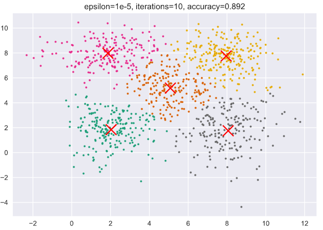

<br/>
<br/>

<div align=center></div>

<br/>

<center> <font size = 6>2020年春季学期 </font></center>
<center> <font size = 6>计算学部《机器学习》课程 </font></center>

<br/>
<br/>

<center> <font size = 6> Lab3 实验报告 </font></center>

<br/>
<br/>
<br/>
<br/>
<br/>
<br/>
<br/>
<br/><br/>
<br/><br/><br/>
<br/>

<center> <font size = 3> 
<table>
   <tr>
      <td>姓名</td>
      <td>许健</td>
   </tr>
   <tr>
      <td>学号</td>
      <td>1183710113</td>
   </tr>
   <tr>
      <td>班号</td>
      <td>1837101</td>
   </tr>
   <tr>
      <td>电子邮件</td>
      <td>941197279@qq.com</td>
   </tr>
   <tr>
      <td>手机号码</td>
      <td>18945062342</td>
   </tr>
</table>
</font></center>
<br/>
<br/>


<div STYLE="page-break-after: always;"></div>

<!-- 此处用于换行 -->


# 1 实验目的

实现一个k-means算法和混合高斯模型，并且用EM算法估计模型中的参数。


# 2 实验要求及实验环境

## 2.1 实验要求

测试：用高斯分布产生k个高斯分布的数据（不同均值和方差）（其中参数自己设定）。

（1）用k-means聚类，测试效果；

（2）用混合高斯模型和你实现的EM算法估计参数，看看每次迭代后似然值变化情况，考察EM算法是否可以获得正确的结果（与你设定的结果比较）。

应用：可以UCI上找一个简单问题数据，用你实现的GMM进行聚类。

## 2.2 实验环境

Windows 10, Python 3.8.5, Jupyter notebook


# 3 实验原理

本实验分为两部分：K-means和GMM，这两部分都是属于EM算法，而EM算法主要分为两步：

- E步：求期望
- M步：求最大似然

E步是调整分布，M步是根据E步得到的分布求得当前分布下取到最大似然时的参数，然后更新参数，再次进入E步根据得到的参数调整新的分布，如此往复循环，直到参数收敛。

## 3.1 K-means

给定训练样本$X=\{x_1, x_2, ..., x_m\}$，和划分聚类的数量 $k$，给出一个簇划分$C=C_1,C_2,...,C_k$，使得该划分的平方误差$E$最小化，即使下式取最小值：
$$
E=\sum^k_{i=1}\sum_{x\in C_i}||x-\mu_i||^2_2
$$
其中，$\mu_i=\frac 1 {|C_i|}\sum_{x\in C_i}x_i$，它是簇$C_i$的均值向量。$E$刻画了簇内样本围绕簇的均值向量的紧密程度，$E$越小簇内样本的相似度越高。

具体迭代过程如下：
1. 根据输入的超参数$K$首先初始化一些向量（可以从现有的向量中挑选），作为各簇的均值向量。
2. 根据初始化的均值向量给出训练样本的一个划分，计算各个训练样本到各个均指向量的距离，找出距离最近的均值向量，并将该样本分至该均值向量所代表的簇。
3. 根据新的簇划分，重新计算每个簇的均值向量，如果新的均值向量与旧的均值向量差小于$\varepsilon$，则认为算法收敛；否则，更新均值向量，回到第2步重新迭代求解。

K-means算法的流程图如下：

```flow
st=>start: Start
in=>inputoutput: 输入期望的聚类数K
init=>operation: 随机选取K个样本为初始聚类中心
eStep=>operation: 遍历样本，根据样本到每个
中心的距离确定它的标签
mStep=>operation: 根据得到的标签重新计算样本中心
cond=>condition: 聚类中心收敛?
e=>end
st->in->init->eStep->mStep->cond
cond(yes)->e
cond(no)->eStep
```

K-means实现：

```python
def kmeans(X, k, epsilon=1e-5):
    """
    K-means算法实现，算得分类结果和中心
    """
    center = np.zeros((k, X.shape[1]-1))
    for i in range(k):
        center[i,:] = X[np.random.randint(0, high=X.shape[0]),:-1]
    while True:
        distance = np.zeros(k)
        # 根据中心重新给每个点贴分类标签
        for i in range(X.shape[0]):
            for j in range(k):
                distance[j] = np.linalg.norm(X[i,:-1] - center[j, :])
            X[i, -1] = np.argmin(distance)
        # 根据每个点新的标签计算它的中心
        new_center = np.zeros((k, X.shape[1]-1))
        count = np.zeros(k)
        for i in range(X.shape[0]):
            new_center[int(X[i, -1]), :] += X[i, :-1] # 对每个类的所有点坐标求和
            count[int(X[i, -1])] += 1
        for i in range(k):
            new_center[i, :] = new_center[i, :] / count[i] # 对每个类的所有点坐标求平均值
        if np.linalg.norm(new_center - center) < epsilon: #用差值的二范数表示精度
            break
        else:
            center = new_center
    return X, center
```


## 3.2 GMM

多元高斯分布生成的 $d$ 维随机变量 $x$ 的密度函数为：
$$
p(x|\mu, \Sigma)=\frac 1 {(2\pi)^\frac d 2 |\Sigma|^\frac 1 2}\exp(-\frac 1 2(x-\mu)^T\Sigma^{-1}(x-\mu))
$$
其中 $\mu$ 为 $d$ 维的均值向量，$\Sigma$ 为 $d\times d$ 的协方差矩阵。

给定训练样本集 $X=\{x_1, x_2, ..., x_n\}$，它是一个 $n\times d$ 的矩阵，$n$ 为样本数量，$d$ 为单个样本的维度数量。对于一个样本 $x_i$，我们可以认为它是由多个对应维度的多元高斯分布所生成，所以⾼斯分布的线性叠加来表征数据，假设数据由 $k$ 个高斯分布混合生成：
$$
p(x_i)=\sum^k_{j=1}\pi_jp(x_i|\,u_j, \Sigma_j)
$$
其中 $\mu_j$ 和 $\Sigma_j$ 是第 $j$ 个高斯分布的均值和协方差矩阵，$\pi_j$ 为相应的混合系数，满足$\displaystyle\sum^k_{j=1}\pi_j=1$
。因此，我们也可以认为该数据的生成相当于从 $k$ 个高斯分布中挑选出一个所生成，我们设 $k$ 维二值变量 $z$，这个变量采⽤了 “$1-of-k$” 表⽰⽅法，其中⼀个特定的元素 $z_j$ 等于1，其余所有的元素等于0。于是 $z_j$ 的值满⾜ $z_j \in \{0, 1\}$ 且 $\displaystyle\sum_j z_j=1$，则 $\pi_j$ 加权平均概率值可以表征 $z$ 的分布，也就是说 $z$ 的先验分布为：
$$
p(z)=\prod^k_{j=1} \pi^{z_j}_j
$$
而在看到 $x_i$ 的情况下 $z$ 的后验概率为：
$$
\gamma(z_j)\equiv p(z_j = 1|x_i) = 
\frac{p(z_j = 1)p(x_i|z_j = 1)}{p(x_i)}
= \frac{\pi_jp(x_i|\mu_j, \Sigma_j)}{\sum\limits_{l=1}^k\pi_lp({x_i}|{\mu_l}, \Sigma_j)}
$$

当后验概率已知时，混合高斯模型将训练样本划分成了 $k$ 个簇 $C = C_1, C_2, ... , C_k$，对于每一个样本 $x_i$，其类别为 $j$，满足$j=\arg\displaystyle\max_j \gamma(z_j)$，即选择后验概率最大的类别作为标签类别。因此，当我们观测到样本集 $X$ 时可以采用极大似然估计来求解样本的类别分布：
$$
\ln p(X|\pi, \mu, \Sigma) = \ln \prod_{i=1}^n p(x_i)=\sum_{i=1}^n\ln \sum^k_{j=1}\pi_jp(x_i|\,u_j, \Sigma_j)
$$
使上式最大化，对 $\mu_j$ 求导令导数为0：
$$
\frac {\partial \ln p(X|\pi, \mu, \Sigma)} {\partial \mu_j} 
= \sum_{i=1}^n \frac{\pi_j p(x_i| \mu_j, \Sigma_j)}{\displaystyle\sum_{l=1}^k \pi_l p(x_i| \mu_l, \Sigma_l)} \Sigma_j^{-1}(x_i - \mu_j) = 0
$$

令
$$
\gamma(z_{ij}) =\frac {p(z_j = 1|x_i)}{\displaystyle\sum_{j=1}^k p(z_j = 1|x_i)}=\frac{\pi_j p(x_i| \mu_j, \Sigma_j)}{\displaystyle\sum_{l=1}^k \pi_l p(x_i| \mu_l, \Sigma_l)}
$$

则上式解得
$$
n_j = \sum_i \gamma(z_{ij})\\
\mu_j = \frac 1 {n_j}\sum_{i=1}^n\gamma(z_{ij})x_i
$$

同理，对 $\Sigma_j$ 求导令导数为0：

$$
\frac {\partial \ln p(X|\pi, \mu, \Sigma)} {\partial \Sigma_j} 
= \sum_{i=1}^n \frac{\pi_j p(x_i| \mu_j, \Sigma_j)}{\displaystyle\sum_{l=1}^k \pi_l p(x_i| \mu_l, \Sigma_l)} (\Sigma_j^{-1} - \Sigma_j^{-1}(x_i -\mu_j)(x_i -\mu_j)^T\Sigma_j^{-1}) = 0
$$
解得
$$
\Sigma_j = \frac {\displaystyle\sum_{i=1}^n\gamma(z_{ij})(x_i -\mu_j)(x_i -\mu_j)^T} {n_j}
$$

对于混合系数 $\pi_j$，还需要满足约束条件 $\displaystyle\sum^k_{j=1}\pi_j=1$。构造拉格朗日多项式：

$$
\ln p(X|\pi, \mu, \Sigma) + \lambda(\sum_{j=1}^k \pi_j - 1)
$$
对 $\pi_j$ 求导，令导数为0：
$$
\frac {\partial \ln p(X|\pi, \mu, \Sigma) + \lambda(\displaystyle\sum_{j=1}^k \pi_j - 1)} {\partial \pi_j} 
=\sum_{i=1}^n \frac{p(x_i| \mu_j, \Sigma_j)}{\displaystyle\sum_{l=1}^k \pi_l p(x_i| \mu_l, \Sigma_l)} + \lambda = 0
$$
同乘 $\pi_j$ 并将 $j \in \{1,2,...,k\}$ 代入相加得：
$$
\sum_{j=1}^k \pi_j \frac{p(x_i| \mu_j, \Sigma_j)}{\displaystyle\sum_{l=1}^k \pi_l p(x_i| \mu_l, \Sigma_l)} + \lambda\sum_{j=1}^k \pi_j = 0
$$
将约束条件代入：
$$
\sum_{i=1}^n (\frac{\displaystyle\sum_{j=1}^k \pi_j p(x_i| \mu_j, \Sigma_j)}{\displaystyle\sum_{l=1}^k \pi_l p(x_i| \mu_l, \Sigma_l)}) + \lambda\sum_{j=1}^k \pi_j = n + \lambda = 0
$$
即 $\lambda = -n$，代入 $\displaystyle\sum_{i=1}^n \frac{p(x_i| \mu_j, \Sigma_j)}{\displaystyle\sum_{l=1}^k \pi_l p(x_i| \mu_l, \Sigma_l)} + \lambda = 0$ 中，得
$$
\pi_j = \frac {n_j}{n}
$$

GMM算法过程如下：

1. 随机初始化参数 $\pi_i, \mu_i, \Sigma_i,\ \ i\in \{1,2, ... ,k\}$

2. E步：根据式 $\gamma(z_j)= \frac{\pi_jp(x_i|\mu_j, \Sigma_j)}{\sum\limits_{l=1}^k\pi_lp({x_i}|{\mu_l}, \Sigma_j)}$ 计算每个样本由各个混合高斯成分生成的后验概率

3. M步：用下式更新参数 $\pi_i, \mu_i, \Sigma_i,\ \ i\in \{1,2, ... ,k\}$
   $$
   \pi_j = \frac {n_j}{n}\\
   \mu_j = \frac 1 {n_j}\sum_{i=1}^n\gamma(z_{ij})x_i\\
   \Sigma_j = \frac {\displaystyle\sum_{i=1}^n\gamma(z_{ij})(x_i -\mu_j)(x_i -\mu_j)^T} {n_j}
   $$

4. 如果参数值不再发生变化，根据 $j=\arg\displaystyle\max_j \gamma(z_j)$ 计算标签 $j$，否则，返回第2步

E步实现：

```python
def e_step(x, mu_list, sigma_list, pi_list):
    """
    e步，求每个样本由各个混合高斯成分生成的后验概率
    """
    k = mu_list.shape[0]
    gamma_z = np.zeros((x.shape[0], k))
    for i in range(x.shape[0]):
        pi_times_pdf_sum = 0
        pi_times_pdf = np.zeros(k)
        for j in range(k):
            pi_times_pdf[j] = pi_list[j] * multivariate_normal.pdf(x[i], mean=mu_list[j], cov=sigma_list[j])
            pi_times_pdf_sum += pi_times_pdf[j]
        for j in range(k):
            gamma_z[i, j] = pi_times_pdf[j] / pi_times_pdf_sum
```


m步实现：

```python
def m_step(x, mu_list, gamma_z):
    """
    m步，根据公式更新参数
    """
    k = mu_list.shape[0]
    n = x.shape[0]
    dim = x.shape[1]
    mu_list_new = np.zeros(mu_list.shape)
    sigma_list_new = np.zeros((k, dim, dim))
    pi_list_new = np.zeros(k)
    for j in range(k):
        n_j = np.sum(gamma_z[:, j])
        pi_list_new[j] = n_j / n # 计算新的pi

        gamma = gamma_z[:, j]
        gamma = gamma.reshape(n, 1)
        mu_list_new[j, :] = (gamma.T @ x) / n_j # 计算新的mu
        sigma_list_new[j] = ((x - mu_list[j]).T @ np.multiply((x - mu_list[j]), gamma)) / n_j # 计算新的sigma
    return mu_list_new, sigma_list_new, pi_list_new

```

GMM主算法：

```python
while True:
    gamma_z = e_step(x, mu_list, sigma_list, pi_list)
    mu_list, sigma_list, pi_list = m_step(x, mu_list, gamma_z)
    new_log_l = log_likelihood(x, mu_list, sigma_list, pi_list)
    if (old_log_l - new_log_l) < epsilon:
        break
```


# 4 实验结果与分析

## 4.1 k=3，各分布距离较远

生成k=3的2维数据测试K-Means和GMM的效果，各高斯分布的均值和协方差矩阵均不同。

各高斯分布的均值：[[ 2  6] [ 8 10] [ 8  2]]


### 4.1.1 K-means

下图的各中心坐标：[[ 8.01793576  1.79108972] [ 8.03150573 10.1021806 ] [ 2.24065269  5.92428314]]


下图的各中心坐标：[[ 8.0836514  10.09409582] [ 2.13241573  6.07466331] [ 7.90305055  1.85080409]]


下图的各中心坐标：[[ 7.90305055  1.85080409] [ 2.13241573  6.07466331] [ 8.0836514  10.09409582]]


从图中可以看出，随着精度的增大，准确率都在0.98，变化不大，但精度从1变为1e-5时，求得的聚类中心准确度增大了。

### 4.1.2 GMM


可以看出，在本条件下，GMM得到的结果要比K-means得到的结果好一些。分类结果都在0.993以上，随精度的变化不大，所以推断它已经收敛到了一定程度，甚至各参数不再发生变化，再看各次运行时的最大似然对数，发现最大似然对数确实在增大，而大约从第30次迭代开始，就不再发生变化了，这也就解释了为什么在这些精度下不随精度的增大而变化。

## 4.2 k=5，各分布距离较近

生成k=5的2维数据测试K-Means和GMM的效果，各高斯分布的均值和协方差矩阵均不同。

各高斯分布的均值：[[2 2] [2 8] [5 5] [8 2] [8 8]]


### 4.2.1 K-means

下图的各中心坐标：[[1.81126365 1.70455608] [7.98534324 1.60414057] [4.68148749 4.42232503] [7.92856289 7.40125028] [2.31526297 7.84828289]]


下图的各中心坐标：[[8.06352571 1.74963954] [7.95994276 7.75805996] [1.86714372 7.97501538] [5.08440337 5.18070716] [2.03251864 1.8425656 ]]



下图的各中心坐标：[[1.86714372 7.97501538] [8.06352571 1.74963954] [7.95994276 7.75805996] [5.08440337 5.18070716] [2.03251864 1.8425656 ]]


### 4.2.2 GMM


可以看出在精度较低时，GMM的效果并不好，但提高精度后，准确率和大幅度提升，最后比K-means的分类效果要好一点。

## 4.3 UCI数据集


# 5 结论

K-Means实际上假设数据式呈球状分布，假设使用的欧式距离来衡量样本与各个簇中心的相似度(假设数据的各个维度对于相似度计算的作用是相同的)，它的簇中心初始化对于最终的结果有很大的影响，如果选择不好初始的簇中心值容易使之陷入局部最优解；与之相比GMM使用更加一般的数据表示即高斯分布，GMM使用EM算法进行迭代优化，因为其涉及到隐变量的问题，没有之前的完全数据，而是在不完全数据上进行。

K-Means其实就是一种特殊的高斯混合模型，假设每种类在样本中出现的概率相等均为 $\frac 1 k$ , 而且假设高斯模型中的每个变量之间是独立的，即变量间的协方差矩阵是对角阵，这样我们可以直接用欧氏距离作为K-Means的协方差去衡量相似性；K-Means对响应度也做了简化，每个样本只属于一个类，即每个样本属于某个类响应度为1，对于不属于的类响应度设为0，算是对GMM的一种简化。而在高斯混合模型中，每个类的数据出现在样本中的概率为，用协方差矩阵替代K-Means中的欧式距离去度量点和点之间的相似度，响应度也由离散的0，1变成了需要通过全概率公式计算的值。由于GMM不像K-means做了很多假设，所以分类最终效果比K-Means好，但是GMM-EM算法过于细化，容易被噪声影响，所以适合对K-Means的分类结果进行进一步优化。